# Lab05 GitLab 操作指南

## 一、创建 GitLab 账号

1. 访问 [UNSW GitLab](https://gitlab.cse.unsw.edu.au/)
2. 点击 **Login with UNSW Single Sign On (SSO - zID@ad.unsw.edu.au)** 按钮登录
3. 使用你的 zID 和 zPass 完成登录

## 二、配置 SSH 密钥

### 1. 检查本地是否已有 SSH 密钥

```bash
ls -la ~/.ssh
```


如果看到 `id_rsa` 和 `id_rsa.pub` 文件，说明已存在，可以跳过密钥生成步骤。


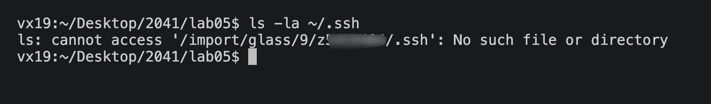
我这里就是不存在的


### 2. 生成 SSH 密钥（如果没有）

```bash
ssh-keygen -t ed25519 -C "z5555555@ad.unsw.edu.au"
```

按回车接受默认路径，然后设置密码。

image.png

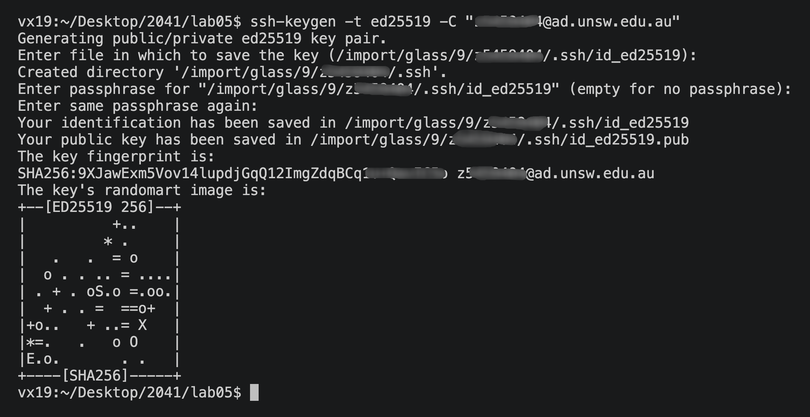


### 3. 查看并复制公钥

```bash
cat ~/.ssh/id_rsa.pub
```

或者

```bash
cat ~/.ssh/id_ed25519.pub
```

复制输出的内容。

### 4. 在 GitLab 添加公钥

1. 访问 [SSH Keys 设置页面](https://gitlab.cse.unsw.edu.au/-/user_settings/ssh_keys)
2. 点击 **Add new key**

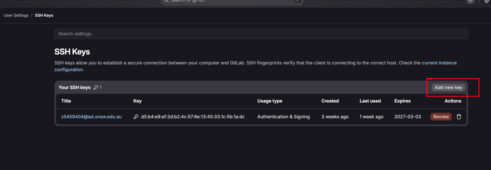

3. 粘贴公钥内容，填写标题（可填设备名）
4. 点击 **Add key**


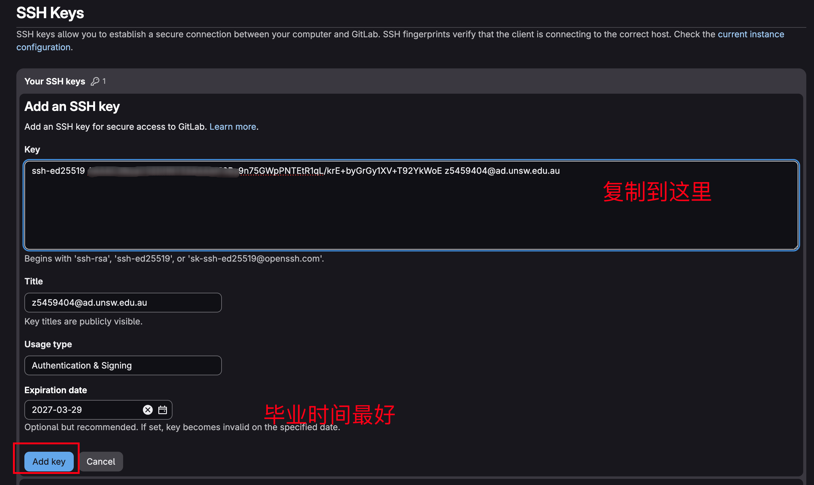


## 三、创建远程仓库

1. 登录后进入 GitLab Dashboard
2. 点击右上角蓝色 **New project** 按钮
3. 选择 **Create blank project**
4. 填写项目信息：
   - Project name：项目名称
   - Visibility level：选择 **Private**
   - 取消勾选 **Initialize repository with a README**
5. 点击 **Create project**

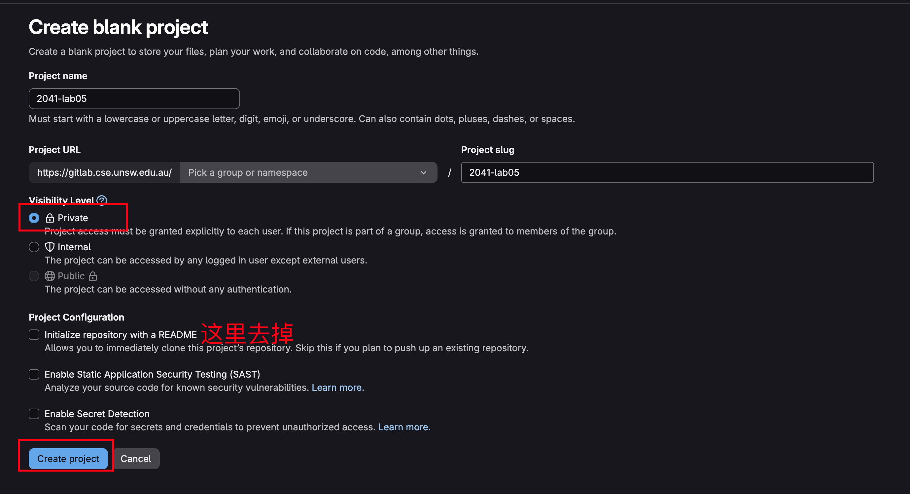
点击create Project 进入

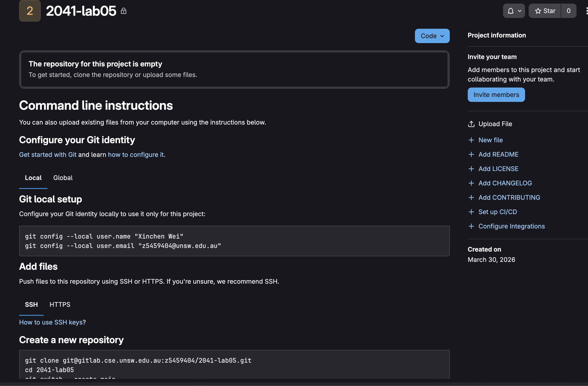


## 四、创建本地仓库并关联

### 1. 初始化本地仓库

```bash
git init <仓库名称>
cd <仓库名称>
```

### 2. 关联远程仓库

1. 在 GitLab 项目页面点击蓝色 **Clone** 按钮
2. 复制 **Clone with SSH** 下的 URL
3. 在本地执行：

```bash
git remote add origin git@gitlab.cse.unsw.edu.au:z5555555/2041-lab05.git
```

这个指令在最后一行


### 3. 验证远程仓库连接

```bash
git remote -v
```

## 五、添加、提交和推送文件

### 1. 创建文件

```bash
echo "Hello Git" > my_first_git_file.txt
```

### 2. 添加文件到暂存区

```bash
git add my_first_git_file.txt
```

或添加所有文件：

```bash
git add .
```

### 3. 提交文件

```bash
git commit -m "add my_first_git_file.txt"
```

### 4. 推送到远程仓库

```bash
git push -u origin main
```

如果是新仓库没有默认分支，可能需要用：

```bash
git push -u origin master
```

### 5. 验证推送成功

在 GitLab 页面刷新，确认文件已显示。


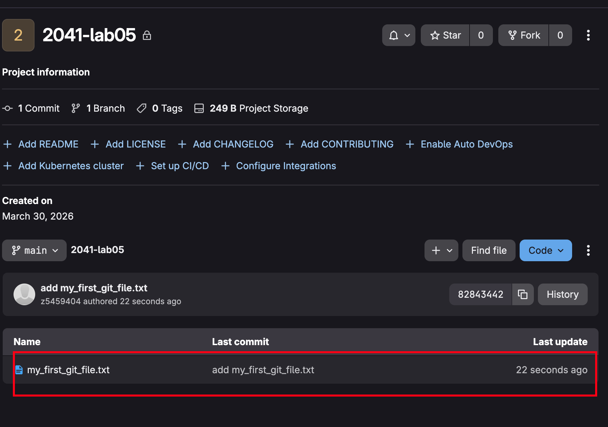

## 六、邀请课程账号为协作者

1. 进入 GitLab 项目页面
2. 点击左侧 **Manage** 标签
3. 点击左侧 **Members** 标签
4. 在 **Invite member** 区域：
   - Username or Email：输入 `COMP2041`
   - Select a role：选择 **Developer**
5. 点击 **Invite** 按钮发送邀请

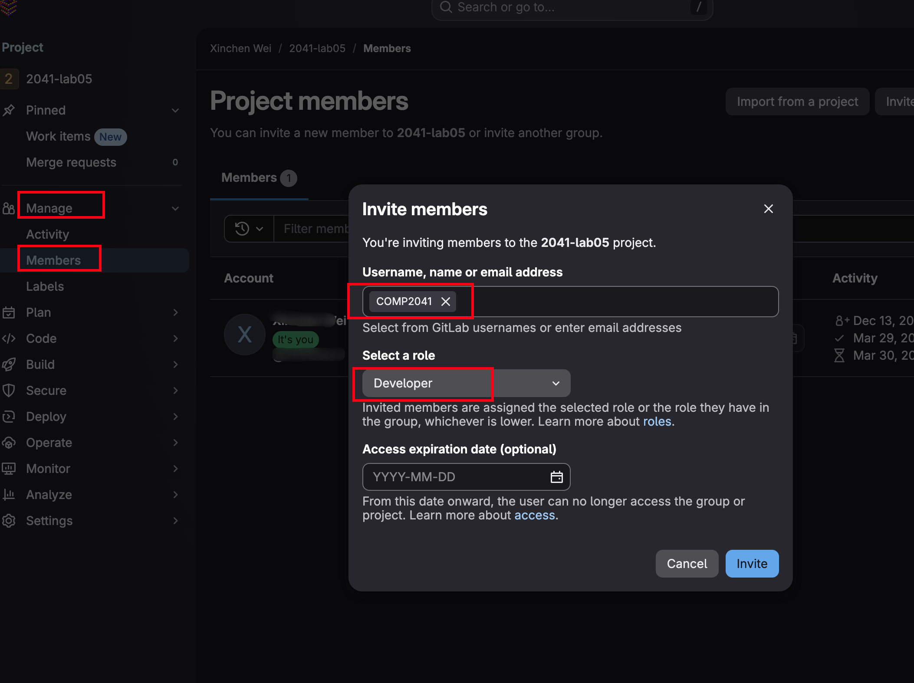


## 七、运行 Autotest 测试

```bash
2041 autotest gitlab_new_repo 2041-lab05
```

注意：`repo-url` 是 HTTPS 网页 URL，不是 SSH 克隆 URL。

## 八、创建 GitLab Issue

在工业界，使用 Issue 来跟踪任务是非常常见的做法。以下是完成这个练习的步骤。

### 1. 创建 Issue

1. 进入你之前创建的 GitLab 仓库页面
2. 在左侧边栏点击 **Plan** 选项
3. 点击 **New issue** 按钮开始创建

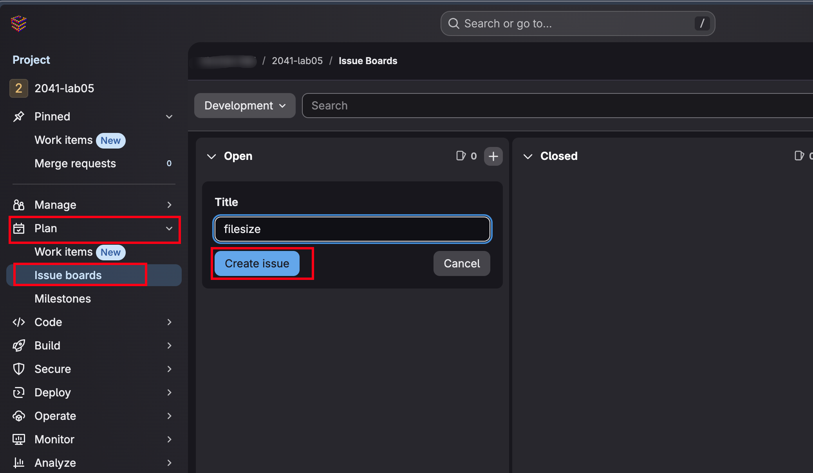


### 3. 填写 Issue 信息

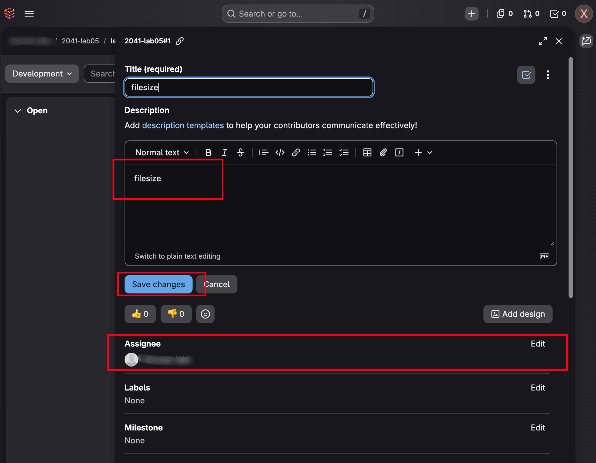


### 2. 本地实现任务

回到本地机器，实现你在 Issue 中描述的 Shell 脚本。

示例 - 创建一个统计文件数量的脚本：

```bash
#!/bin/bash

# 检查参数数量
if [ $# -ne 1 ]; then
    echo "Usage: $0 <directory>"
    exit 1
fi

dir="$1"

# 检查目录是否存在
if [ ! -d "$dir" ]; then
    echo "Error: Directory '$dir' does not exist"
    exit 1
fi

# 统计文件数量（不包括目录）
count=$(find "$dir" -type f | wc -l)
echo "Number of files in '$dir': $count"
```

保存文件并添加执行权限：

```bash
chmod +x count_files.sh
```

### 4. 提交并推送代码

```bash
git add count_files.sh
git commit -m "add file count script"
git push -u origin main
```

### 5. 验证推送成功

返回 GitLab 页面，刷新确认文件已显示。

### 6. 关闭 Issue

1. 进入项目的 **Issues** 页面
2. 找到你创建的 Issue
3. 点击 **Close issue** 按钮关闭

可选：添加评论说明任务已完成。


### 7. 运行 Autotest 测试

```bash
2041 autotest gitlab_create_issue https://gitlab.cse.unsw.edu.au/z5xxxxxx/2041-lab05
```

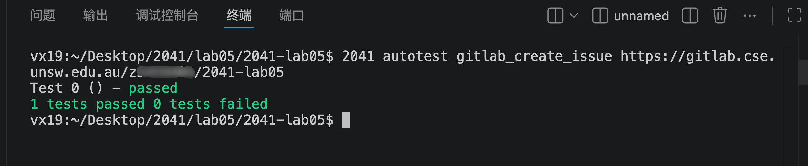

## 九、使用 Git 分支和 Merge Request

直接向默认分支推送代码通常不是好习惯。默认分支是他人查看仓库时首先看到的分支，应该保持代码干净、经过注释、测试且功能正常。开发新功能时，应该创建一个新分支，完成后再合并到默认分支。

### 1. 创建并切换到新分支

创建新分支并切换（一步完成）：

```bash
git checkout -b feature/my-feature
```

或者分两步完成：

```bash
git branch feature/my-feature
git checkout feature/my-feature
```

### 2. 在新分支上开发

在新分支上实现你的新功能，可以创建新文件、修改现有文件或两者兼有。

### 3. 提交并推送

```bash
git add .
git commit -m "add new feature"
git push -u origin feature/my-feature
```

Git 会提示你链接本地分支到远程仓库，按照提示命令执行即可。

### 4. 在 GitLab 上查看新分支

在 GitLab 页面，左上角有分支切换菜单，选择你的新分支即可看到你的新功能。


### 5. 创建 Merge Request

1. 进入 GitLab 仓库页面
2. 在左侧边栏点击 **Merge requests**
3. 点击 **New merge request** 按钮


### 6. 选择源分支和目标分支

1. **Source branch（源分支）**：选择你的功能分支
2. **Target branch（目标分支）**：选择默认分支（main 或 master）
3. 点击 **Compare branches and continue**


### 7. 填写 Merge Request 信息

1. **Title（标题）**：反映你实现的功能
2. **Description（描述）**：描述任务和完成内容
3. **取消勾选 Delete source branch**（保留功能分支）
4. **Assignee**：指派给自己
5. 可选：添加 Milestone 和 Labels

点击 **Create merge request** 创建。


### 8. 审核并合并

1. Merge Request 创建后，你可以选择自己批准
2. 确认无误后，点击 **Merge** 按钮合并到默认分支
3. 可选：添加评论说明


### 9. 运行 Autotest 测试

```bash
2041 autotest gitlab_new_branch https://gitlab.cse.unsw.edu.au/z5xxxxxx/2041-lab05
```

## 十、文档化你的 GitLab 仓库

开源项目需要文档帮助社区成员快速了解项目。以下是创建文档的步骤。

### 1. 学习 Markdown

如果你不熟悉 Markdown，可以访问 [Markdown Tutorial](https://www.markdowntutorial.com/) 进行约 10 分钟的学习。

### 2. 创建 README.md

README.md 是项目的入口文档，应包含：

- 项目标题
- 作者信息（目前是你自己）
- 项目目标
- 使用的编程语言和工具，以及对应的文档链接

示例：

```markdown
# My Project

## 项目标题
**文件统计工具** - 一个简单的 Shell 脚本

## 作者
- z5xxxxxx (Your Name)

## 项目目标
本项目旨在提供一个轻量级的命令行工具，用于统计指定目录下的文件数量。

## 技术栈
- **Shell 脚本** - [Bash 文档](https://www.gnu.org/software/bash/)
- **Git** - [Git 文档](https://git-scm.com/doc)

## 使用方法
```bash
./count_files.sh <directory>
```
```

### 3. 创建 INSTALL.md

INSTALL.md 面向新用户，说明如何安装和运行项目。

示例：

```markdown
# 安装指南

## 克隆仓库
```bash
git clone https://gitlab.cse.unsw.edu.au/z5xxxxxx/2041-lab05.git
cd 2041-lab05
```

## 运行项目
1. 添加执行权限：
```bash
chmod +x count_files.sh
```

2. 运行脚本：
```bash
./count_files.sh <目录路径>
```
```

### 4. 选择开源许可证

1. 访问 [ChooseALicense.com](https://choosealicense.com/licenses/)
2. 选择适合你项目的许可证（没有绝对的对错）
3. 阅读许可证条款，理解其含义

常见许可证：
- **MIT** - 宽松，允许任何使用方式
- **GPL** - 要求衍生作品也必须开源
- **Apache** - 类似 MIT，包含专利授权

### 5. 创建 LICENSE 文件

将选定的许可证全文复制到项目根目录的 `LICENSE` 文件中。

以 MIT 许可证为例：

```bash
curl -o LICENSE https://raw.githubusercontent.com/github/gitignore/main/LICENSE
```

或手动创建并粘贴许可证内容。

### 6. 可选：添加其他常见文件

- **CONTRIBUTING.md** - 说明如何为项目贡献代码
- **CHANGELOG.md** - 记录版本变更历史

### 7. 提交并推送文档

```bash
git add README.md INSTALL.md LICENSE
git commit -m "add project documentation"
git push -u origin main
```

### 7. 运行 Autotest 测试

```bash
2041 autotest gitlab_document_code https://gitlab.cse.unsw.edu.au/z5xxxxxx/2041-lab05
```

## 十一、提交作业

当你完成所有练习后，需要提交作业：

```bash
give cs2041 lab05_gitlab_new_branch gitlab_new_branch.c
```

截止日期：2026 年 3 月 30 日 12:00（周一中午）

## 十二、注意事项

- 保持项目存在直到学期结束
- 课程账号 `COMP2041` 需保持为协作者才能获得分数
- 如果需要，可以删除 `README.md` 文件后重新创建
- Issue 标题应清晰反映任务内容
- Merge Request 创建后记得取消勾选删除源分支