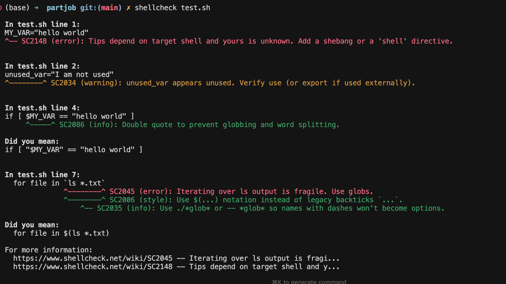

# shell风格自动化


注意
**在学校的vlab上执行，不要用自己的电脑**
否则就要安装 shfmt 这个工具


# 使用 shfmt 进行格式化


直接修改并保存文件（最常用）：

## 26T1 作业

```shell
shfmt -w turnip-*
```


## 对于其他的作业

```shell
shfmt -w <filename>
```

# 例子

比如有这样一个代码

```shell
MY_VAR="hello world"
unused_var="I am not used"

if [ $MY_VAR == "hello world" ]
then
echo    "Variable matches!"
  for file in `ls *.txt`
  do
echo "Checking file: $file"
  done
fi

# 这里的缩进非常随意
    echo "Done";
```

运行风格检查




然后执行

```shell
shfmt -w -i 4 -ci test.sh
```

变成

```shell
MY_VAR="hello world"
unused_var="I am not used"

if [ $MY_VAR == "hello world" ]; then
    echo "Variable matches!"
    for file in $(ls *.txt); do
        echo "Checking file: $file"
    done
fi

# 这里的缩进非常随意
echo "Done"
```