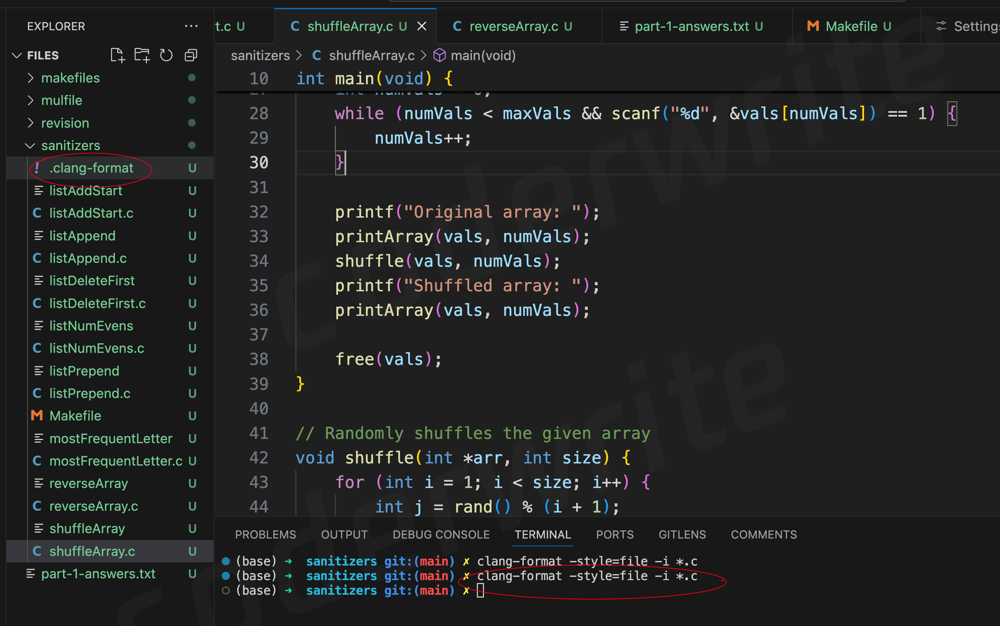

# 2521-风格注意事项

在2521中，我们要保证自己的代码正确的前提下，也要保证自己代码风格是good，否则也会扣分，并且扣的还不少。


可以下载\`.clang-format\`文件




将这个文件，放到对应的要提交.c的同一级目录。

<figure><figcaption></figcaption></figure>

然后执行命令

```shell
clang-format -style=file -i *.c
```

这样就可以将所有的.c文件的格式全部整改好。


请左哥喝咖啡～～

<figure><figcaption></figcaption></figure>


