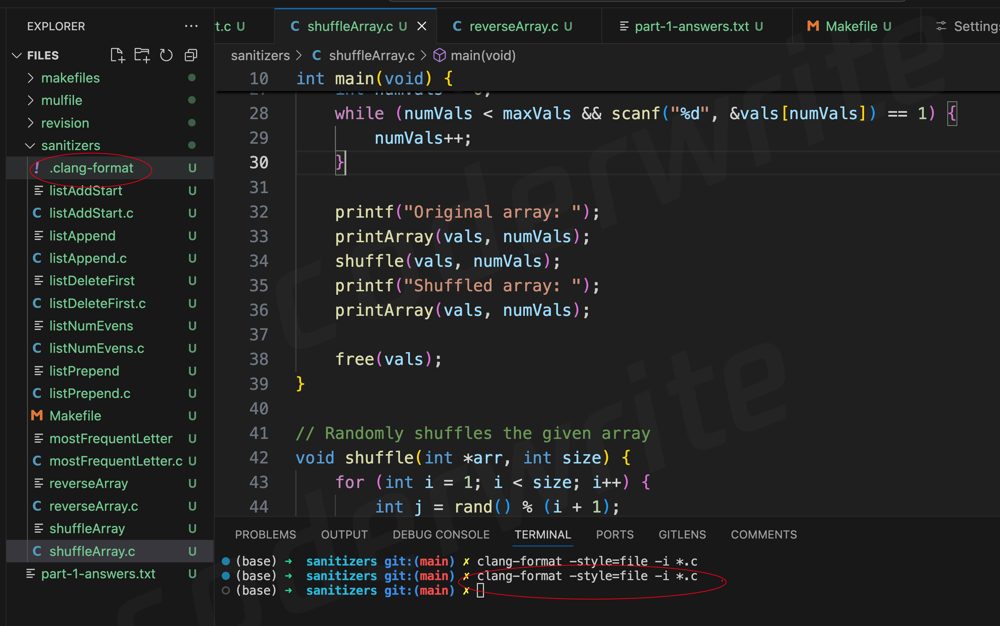

# 24T1

## A1 解析

[作业地址](https://eecs281staff.github.io/p1-letterman/)

<figure><figcaption></figcaption></figure>

eecs281的A1如期而至。

几乎每学期的A1都是一样的，使用dfs和bfs来解决寻路问题。

回想起上学期的23T2学期的A1，小老鼠开灯找路，这学期的单词变换找路问题，还是这学期的稍微简单一点。

整个ass按照老师网页描述的解题思路即可。

1. 命令行参数解析。这个没什么说的，按照getopt来解析就行了，另外pdf上说不用对命令行参数做错误处理。
2. 2.加载单词字典。这里分为两种，一种简单的，那就一行一行读即可。一种复杂的，需要对特殊字符做处理，这样才能将所有单词添加完整。比如尾巴是以&结尾的。这里要注意添加顺序，顺序不同是不可以的
3. 从开始字符找到一条路，这里根据命令行参数，确认选择的容器是stack还是queue。然后选择dequeue的pop操作。
4. 4.这里在确认bfs的邻居的时候，也是需要根据命令行参数来确认都有哪些字符串是当前位置的邻居，比如配置了swap，则需要检查两个字符串是不是可以通过swap完成，如果是的话，打一个标记记录一下&#x20;
5. 就这样一直检查，如果检查到结尾退出。 6.打印结果，这里就反向输出结果就行了，很easy 。

这个最难的还是对时间和空间的衡量，一开始完成的版本，空间复杂度抄了一些，此时要看一下，哪些成员变量是多余的。

另外检查一下数据类型，能用`int`的不要用`long`，也可以减少一些内存。

对于bfs时间优化，这里没有太多技巧，优化的技巧都很朴实无华。

最后是测试用例的编写这个很好写，只要按照文档要求写，基本上就可以找到所有。

